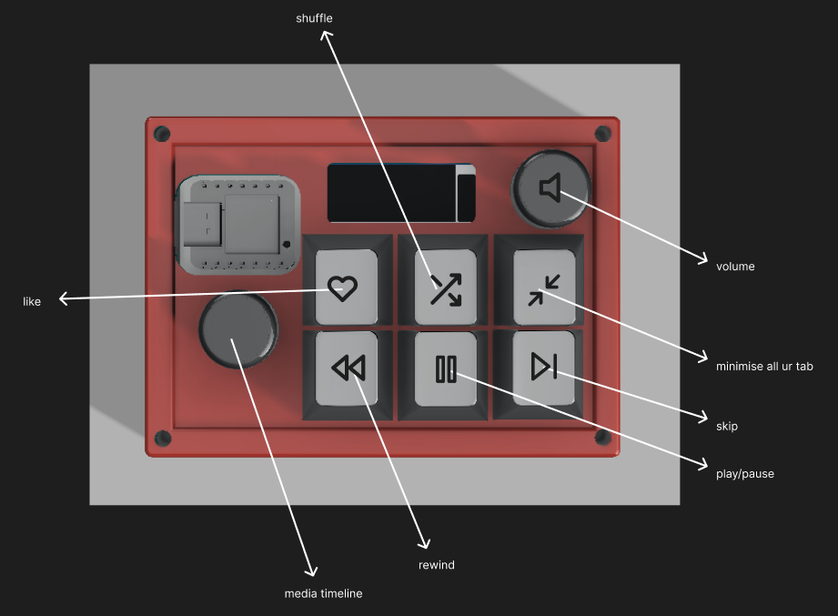
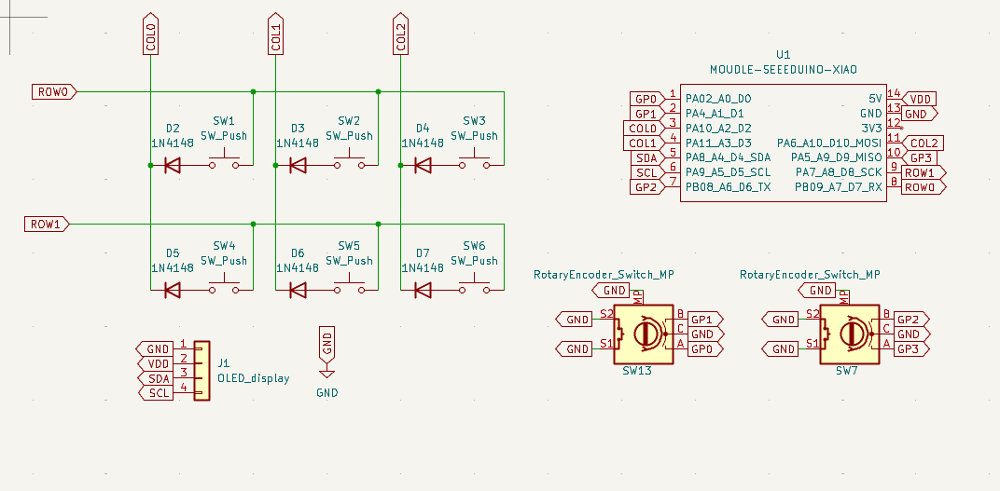
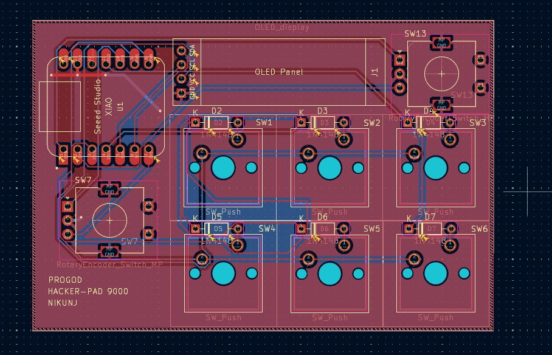

# Spotify Marcro-pad Thingy

[](https://github.com/nikunj-Swarnkar/Spotify_marcro_pad_thingy)
[](https://github.com/nikunj-Swarnkar/Spotify_marcro_pad_thingy/stargazers)
[](https://github.com/nikunj-Swarnkar/Spotify_marcro_pad_thingy/forks)
[](https://github.com/nikunj-Swarnkar/Spotify_marcro_pad_thingy/blob/main/LICENSE)
[](https://github.com/KMKfw/kmk_firmware)

A custom key macropad with two rotating dials, 6 customisable keys, and an OLED screen. Basically my iteration of the Spotify car thing — but for your desk.

**Project by [nikunj-Swarnkar](https://github.com/nikunj-Swarnkar)** — Firmware by [Nitin-2468-dev](https://github.com/Nitin-2468-dev)



---

## Features

- Two-part case, easy to assemble
- 128×32 OLED display
- 2 × EC11 rotary encoders
- 4 heat-set inserts and bolted case
- 6 mechanical keys

---

## CAD Model

Made in Fusion360. Everything fits together using 4 × M3 bolts and heat-set inserts. The case has two parts: a main body and a front lid.


---

## PCB

Made in KiCad.

**Schematic**



**PCB**



Uses MX-style key switches.

---

## Firmware Overview

The Spotify Marcro-pad Thingy runs **[KMK firmware](https://github.com/KMKfw/kmk_firmware)** on a **[Seeed XIAO RP2040](https://wiki.seeedstudio.com/XIAO-RP2040/)**, paired with a **Python bridge application** that connects Spotify playback data to the keyboard over USB. The device behaves like a mini StreamDeck dedicated to music control.

### Playback Controls

| Key        | Action          |
| ---------- | --------------- |
| Play/Pause | Toggle playback |
| Next       | Next track      |
| Previous   | Previous track  |
| Shuffle    | Toggle shuffle  |
| Repeat     | Toggle repeat   |
| Mute       | Set volume to 0 |

### Encoder Controls

| Encoder   | Function       |
| --------- | -------------- |
| Encoder 1 | Track timeline |
| Encoder 2 | Volume         |

### Key Layout

```
[ Like ]     [ Shuffle ]    [ Minimize ]
[ Rewind ]   [ Play/Pause ] [ Skip ]
```

---

## OLED Display

### Spotify Screen

```
Spotify
Blinding Lights
████░░░░░░ 1:42
```

Displays song title, playback progress bar, and current playback time.

### Volume Screen

```
Volume
██████░░░░ 60%
```

Displayed when adjusting volume.

### Idle Screen

An animated BongoCat appears when nothing is playing.

---

## Album Art Rendering

Album art is fetched from Spotify and processed by the bridge:

1. Download image
2. Resize to 32×32
3. Convert to monochrome
4. Send bitmap to keyboard

The OLED displays the artwork beside the track information.

---

## System Architecture

```
Spotify App
      ↓
Spotify Web API
      ↓
spotify_bridge.exe (Python)
      ↓
USB Serial
      ↓
KMK Firmware
      ↓
Macropad Hardware
      ↓
OLED Display + Controls
```

The bridge application handles Spotify API communication; the firmware handles hardware interaction.

---

## Serial Protocol

Communication between the firmware and bridge uses a lightweight text protocol:

```
SONG|title|artist|position|duration|tempo
VOL|70
IDLE
COVER|bitmap_data
CMD|NEXT
CMD|PLAY
CMD|SEEK|120
```

---

## Firmware

Written using **KMK (Keyboard Module Kit)** on CircuitPython. Main file: `CIRCUITPY/code.py`

**Responsibilities:**

- Scan key matrix
- Handle rotary encoders
- Communicate with bridge over USB
- Render OLED interface
- Control RGB lighting

### Pin Mapping

**Matrix**

| Function | Pin       |
| -------- | --------- |
| COL 0    | D2 / GP28 |
| COL 1    | D3 / GP29 |
| COL 2    | D10 / GP3 |
| ROW 0    | D7 / GP1  |
| ROW 1    | D8 / GP2  |

**Encoder 1 — Volume**

| Signal | Pin       |
| ------ | --------- |
| A      | D0 / GP26 |
| B      | D1 / GP27 |

**Encoder 2 — Track Scrub**

| Signal | Pin      |
| ------ | -------- |
| A      | D6 / GP0 |
| B      | D9 / GP4 |

**OLED**

| Signal | Pin      |
| ------ | -------- |
| SDA    | D4 / GP6 |
| SCL    | D5 / GP7 |

**RGB LEDs:** DATA → D0 / GP26

---

## Folder Structure

| Path | Description |
| ---- | ----------- |
| [`LICENSE`](https://github.com/nikunj-Swarnkar/Spotify_marcro_pad_thingy/blob/main/LICENSE) | MIT License |
| [`README.md`](https://github.com/nikunj-Swarnkar/Spotify_marcro_pad_thingy/blob/main/README.md) | This file |
| [`CIRCUITPY/`](https://github.com/nikunj-Swarnkar/Spotify_marcro_pad_thingy/tree/main/CIRCUITPY) | Firmware files copied to the board |
| [`CIRCUITPY/code.py`](https://github.com/nikunj-Swarnkar/Spotify_marcro_pad_thingy/blob/main/CIRCUITPY/code.py) | Main firmware entry point |
| [`CIRCUITPY/display_manager.py`](https://github.com/nikunj-Swarnkar/Spotify_marcro_pad_thingy/blob/main/CIRCUITPY/display_manager.py) | OLED display logic |
| [`CIRCUITPY/duck_animation.py`](https://github.com/nikunj-Swarnkar/Spotify_marcro_pad_thingy/blob/main/CIRCUITPY/duck_animation.py) | Idle duck animation |
| [`CIRCUITPY/rgb_manager.py`](https://github.com/nikunj-Swarnkar/Spotify_marcro_pad_thingy/blob/main/CIRCUITPY/rgb_manager.py) | RGB LED control |
| [`CIRCUITPY/lib/`](https://github.com/nikunj-Swarnkar/Spotify_marcro_pad_thingy/tree/main/CIRCUITPY/lib) | CircuitPython libraries |
| [`spotify_bridge/`](https://github.com/nikunj-Swarnkar/Spotify_marcro_pad_thingy/tree/main/spotify_bridge) | PC bridge application |
| [`spotify_bridge/spotify_bridge.exe`](https://github.com/nikunj-Swarnkar/Spotify_marcro_pad_thingy/blob/main/spotify_bridge/spotify_bridge.exe) | Compiled bridge (no Python required) |
| [`spotify_bridge/code/spotify_bridge.py`](https://github.com/nikunj-Swarnkar/Spotify_marcro_pad_thingy/blob/main/spotify_bridge/code/spotify_bridge.py) | Bridge source code |
| [`spotify_bridge/code/oled_test_app.py`](https://github.com/nikunj-Swarnkar/Spotify_marcro_pad_thingy/blob/main/spotify_bridge/code/oled_test_app.py) | OLED test utility |
| [`spotify_bridge/code/build_exe.py`](https://github.com/nikunj-Swarnkar/Spotify_marcro_pad_thingy/blob/main/spotify_bridge/code/build_exe.py) | Script to compile the bridge |
| [`spotify_bridge/res/config.json.eg`](https://github.com/nikunj-Swarnkar/Spotify_marcro_pad_thingy/blob/main/spotify_bridge/res/config.json.eg) | Example Spotify API config |
| [`spotify_bridge/res/oled_test_app.exe`](https://github.com/nikunj-Swarnkar/Spotify_marcro_pad_thingy/blob/main/spotify_bridge/res/oled_test_app.exe) | Compiled OLED test utility |
| [`spotify_bridge/res/Duck.gif`](https://github.com/nikunj-Swarnkar/Spotify_marcro_pad_thingy/blob/main/spotify_bridge/res/Duck.gif) | Duck idle animation asset |

---

## Installing Firmware

1. Install CircuitPython for the XIAO RP2040:
   [XIAO RP2040 CircuitPython Guide](https://wiki.seeedstudio.com/XIAO-RP2040-with-CircuitPython/)

2. Copy firmware files to the board at `CIRCUITPY/`.

---

## Spotify Bridge

The bridge software connects the keyboard to Spotify.

**Location:** `spotify_bridge/`

**Run:**

```
spotify_bridge.exe
```

Or:

```
python spotify_bridge.py
```

### Spotify API Setup

1. Create an application at the [Spotify Developer Dashboard](https://developer.spotify.com/dashboard)
2. Add the redirect URI: `http://localhost:8888/callback`
3. Copy your credentials into `spotify_bridge/res/config.json`

---

## Running the System

1. Plug the macropad into USB
2. Launch `spotify_bridge.exe`
3. Start Spotify
4. Use the macropad to control playback

---

## Future Improvements

- Audio visualizer on OLED
- RGB BPM lighting improvements
- System tray bridge application
- Multi-service support (YouTube Music, Apple Music)
- Enhanced OLED UI

---

## Bill of Materials

| Qty | Item                      |
| --- | ------------------------- |
| 6×  | Cherry MX switches        |
| 6×  | DSA keycaps               |
| 4×  | M3×5×4 heat-set inserts   |
| 4×  | M3×16mm SHCS bolts        |
| 6×  | 1N4148 DO-35 diodes       |
| 1×  | 0.91" 128×32 OLED display |
| 2×  | EC11 rotary encoders      |
| 1×  | Seeed XIAO RP2040         |
| 1×  | Case (2 printed parts)    |

---

## License

[MIT License](https://github.com/nikunj-Swarnkar/Spotify_marcro_pad_thingy/blob/main/LICENSE)
